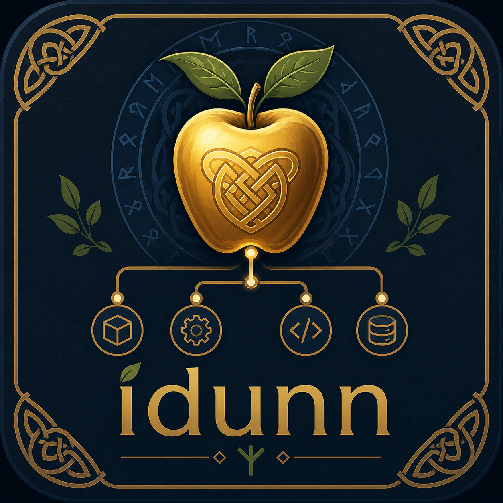

# Idunn 🍎

**Idunn** is a tiny Python dependency inversion / IoC toolkit built around **constructor-time injection only**.



The name comes from **Iðunn / Idunn**, the Norse keeper of the apples that keep the gods young. Idunn uses that image as a DI metaphor: keep the right dependencies close to the system, and the code stays fresh instead of hardening into brittle wiring. 🍏

# 📚 Table-of-Contents

- [Quick-start Guide](#quick-start-guide)
- [Design stance](#design-stance)
- [Install locally](#install-locally)
- [Basic usage](#basic-usage)
- [When does `resolve()` happen?](#when-does-resolve-happen)
- [Recommended application layout 🌳](#recommended-application-layout-)
- [AutoDiscovery rule](#autodiscovery-rule)
- [Port implementation rule](#port-implementation-rule)
- [Multiple adapters and defaults](#multiple-adapters-and-defaults)
- [Environment-specific adapters](#environment-specific-adapters)
  - [Environment matching rules](#environment-matching-rules)
- [Same key, different environments](#same-key-different-environments)
- [The Idunn table](#the-idunn-table)
- [Using Idunn as a singleton](#using-idunn-as-a-singleton)
- [Lifecycles](#lifecycles)
- [Known limitations](#known-limitations)
- [Development workflow 🧪](#development-workflow-)
- [What Idunn intentionally does not do](#what-idunn-intentionally-does-not-do)
- [Code style constraints](#code-style-constraints)
- [Version target](#version-target)
- [Before publishing to PyPI](#before-publishing-to-pypi)

## Quick-start Guide

Idunn is published on [PyPI](https://pypi.org/project/idunn/). Install it with pip:

```bash
pip install idunn
```

(Using Poetry? `poetry add idunn`.)

> `idunn` (lowercase) is the package you install; `Idunn` (the class) is the process-wide
> container you import from it. `Idunn()` always returns that one shared container.

Mark a **port** (`@Port` on a `Protocol`) and bind an **adapter** (`@Adapter`) in modules named
`ports`/`adapters`, let Idunn discover them once at startup, then resolve the port:

```python
from idunn import Idunn
from my_app.ports import CheckoutPort

Idunn().autodiscover("my_app")          # import & register every @Port/@Adapter under my_app
checkout = Idunn().resolve(CheckoutPort)
checkout.run()
```

`autodiscover` is the only registration step you need — it imports the bounded `port(s)`/`adapter(s)`
modules so the decorators run, then registers what it finds. After that, `Idunn().resolve(...)`
hands back a fully-wired service from anywhere in your app.

Even better, you usually don't call `resolve()` yourself: decorate a consumer's constructor with
`@Invert` and its dependencies are injected automatically — see [Basic usage](#basic-usage). A
runnable copy lives in `examples/basic_usage.py`.

## Design stance

| Question | Idunn answer |
|---|---|
| How do I define a dependency? | Create a `Protocol` and mark it with `@Port`. |
| How do I bind behavior? | Mark a concrete class with `@Adapter(...)`. |
| How do I receive dependencies without container code? | Decorate the consumer's constructor with `@Invert`. |
| Does `@Adapter` make the class implement the port? | No. The class must satisfy the `Protocol`, structurally or by inheritance. |
| When are dependencies injected? | When `Idunn().resolve(...)` runs, or when an `@Invert`-decorated constructor is called. |
| What does `autodiscover()` do? | Imports bounded `port(s)` and `adapter(s)` modules, then registers decorated classes. |
| Field injection? | No. |
| Setter injection? | No. |
| External YAML config? | No. |
| Implicit protocol matching? | No. |
| Structural adapter auto-registration? | No. |
| Auto-discovery? | Yes, but only for decorated ports/adapters inside packages or modules named `port`, `ports`, `adapter`, or `adapters`. |
| Multiple adapters? | `key`, `default`, and `envs` cover selection. |
| Environments? | `IDUNN_ENV`, plus decorator-local `envs={...}`. |
| Tooling? | Poetry, pytest, Ruff, and Mypy are configured in `pyproject.toml`. |

## Install locally

```bash
poetry install --with dev
```

## Basic usage

The headline workflow is **decorator-only**: mark ports and adapters, mark consumer constructors
with `@Invert`, and Idunn fills in the dependencies. Normal code never touches the container — the
single bootstrap call (`autodiscover`, or a manual `register_adapter` as below) lives at startup.

```python
from typing import Protocol

from idunn import Adapter, Idunn, Invert, LifecycleEnum, Port


@Port
class AppleBasketPort(Protocol):
  def take_apple(self) -> str: ...


@Adapter(AppleBasketPort, lifecycle=LifecycleEnum.SINGLETON)
class GoldenAppleBasketAdapter(AppleBasketPort):
  def take_apple(self) -> str:
    return "🍎 youth restored"


class Feast:
  basket: AppleBasketPort                # declared for the type checker; @Invert assigns it

  @Invert
  def __init__(self, basket: AppleBasketPort, other: str) -> None:
    self.other = other                   # self.basket is injected and assigned for you

  def serve(self) -> str:
    return f"{self.other}: {self.basket.take_apple()}"


Idunn().register_adapter(GoldenAppleBasketAdapter)   # one-time bootstrap (or Idunn().autodiscover(...))

feast = Feast(other="funky")             # basket is resolved & injected automatically
print(feast.serve())                     # funky: 🍎 youth restored
```

`@Invert` inspects the constructor's type hints; every parameter annotated with a `@Port` is
resolved from the `Idunn()` singleton at construction time and assigned to `self.<name>`. A
caller-supplied argument always wins (`Feast(basket=my_basket, other="x")`), so the class stays
trivially testable. Power users can target a keyed adapter with `@Invert(keys={"basket": "golden"})`,
or inject an unannotated parameter with an explicit map: `@Invert({"basket": AppleBasketPort})`.

## When does `resolve()` happen?

`resolve()` happens when application code asks the container for a port — explicitly via
`Idunn().resolve(...)`, or implicitly when you construct a class whose constructor is decorated
with `@Invert`:

```python
Idunn().resolve(FeastPort)        # explicit
feast = Feast(other="funky")      # implicit: @Invert resolves Feast's @Port parameters
```

Decorators do **not** construct anything. They attach metadata to classes (`@Invert` only wraps the
constructor; nothing is resolved until that constructor actually runs).

`autodiscover()` also does **not** construct anything. It imports bounded modules so decorators have run, finds decorated classes, and registers those classes with the table.

Constructor injection happens during `resolve(...)`:

1. select the active adapter for the requested port;
2. inspect the adapter constructor;
3. recursively resolve constructor parameters annotated with `@Port` protocols;
4. instantiate dependencies first;
5. instantiate the requested adapter;
6. cache singleton instances when requested.

That means dependency order is handled at resolution time. If `FeastAdapter` depends on `AppleBasketPort`, Idunn resolves `AppleBasketPort` before constructing `FeastAdapter`, even if `FeastAdapter` was registered before `GoldenAppleBasketAdapter`.

## Recommended application layout 🌳

Idunn can discover decorated ports and adapters automatically, but discovery is intentionally bounded.

```text
my_app/
  __init__.py
  ports.py
  adapters/
    __init__.py
    apples.py
    payments.py
  billing/
    ports.py
    adapters/
      __init__.py
      stripe.py
```

Then at startup:

```python
from idunn import Idunn
from my_app.ports import CheckoutPort


Idunn().autodiscover("my_app")

checkout = Idunn().resolve(CheckoutPort)
```

`Idunn().autodiscover("my_app")` imports modules whose dotted names contain one of these exact parts:

```text
port
ports
adapter
adapters
```

Ports are imported and registered first. Adapters are imported and registered second.

It does **not** import arbitrary modules just because they are inside your app. It also does **not** register undecorated classes.

## AutoDiscovery rule

Good:

```python
@Port
class AppleBasketPort(Protocol):
    def take_apple(self) -> str: ...


@Adapter(AppleBasketPort)
class GoldenAppleBasketAdapter(AppleBasketPort):
    ...
```

These classes can be found by discovery because they wear the apple badge.

Not registered:

```python
class GoldenAppleBasketAdapter(AppleBasketPort):
    ...
```

Even if the class structurally satisfies the port, Idunn will ignore it unless it is marked with `@Adapter(...)`.

## Port implementation rule

Adapters must satisfy their ports. Idunn does **not** synthesize, monkey-patch, or mutate adapter classes.

Recommended style:

```python
@Adapter(AppleBasketPort)
class GoldenAppleBasketAdapter(AppleBasketPort):
    ...
```

Also valid in Python protocol terms:

```python
@Adapter(AppleBasketPort)
class GoldenAppleBasketAdapter:
    def take_apple(self) -> str:
        return "golden apple"
```

The second form relies on structural typing. The first form is clearer, so examples use explicit inheritance.

## Multiple adapters and defaults

When multiple adapters exist for the same port, Idunn keeps resolution deterministic:

1. `Idunn().resolve(SomePort, key="...")` (or `@Invert(keys={...})`) wins.
2. An active `@Adapter(..., default=True)` wins next.
3. Otherwise, the first active registered adapter for that port wins.

```python
@Port
class AppleBasketPort(Protocol):
    def take_apple(self) -> str: ...


@Adapter(AppleBasketPort, key="orchard")
class OrchardAppleBasketAdapter(AppleBasketPort):
    def take_apple(self) -> str:
        return "ordinary apple"


@Adapter(AppleBasketPort, key="golden", default=True)
class GoldenAppleBasketAdapter(AppleBasketPort):
    def take_apple(self) -> str:
        return "golden apple"
```

Here, `golden` becomes the default even though `orchard` was registered first.

## Environment-specific adapters

Idunn does not use config files. Environment-specific behavior lives in the decorator call.

```python
@Adapter(PaymentPort, key="stripe", default=True, envs={"prod"})
class StripePaymentAdapter(PaymentPort):
    ...


@Adapter(PaymentPort, key="fake", default=True, envs={"test", "ci"})
class FakePaymentAdapter(PaymentPort):
    ...
```

Set the active environment with:

```bash
IDUNN_ENV=test
```

If `IDUNN_ENV` is unset, Idunn uses:

```text
local
```

You can also rebind the singleton's environment directly, which is convenient for tests:

```python
Idunn().reset(environment="prod")
```

### Environment matching rules

| Decorator value | Behavior |
|---|---|
| `envs=None` | Adapter is active in every environment. |
| `envs={"test"}` | Adapter is active only when the table environment is `test`. |
| `envs={"test", "ci"}` | Adapter is active in either `test` or `ci`. |

Environment names are normalized to lowercase, and underscores become hyphens.

## Same key, different environments

This is allowed because the environments do not overlap:

```python
@Adapter(PaymentPort, key="primary", envs={"prod"})
class StripePaymentAdapter(PaymentPort):
    ...


@Adapter(PaymentPort, key="primary", envs={"test"})
class FakePaymentAdapter(PaymentPort):
    ...
```

This is not allowed because both are active in `prod`:

```python
@Adapter(PaymentPort, key="primary", envs={"prod"})
class StripePaymentAdapter(PaymentPort):
    ...


@Adapter(PaymentPort, key="primary", envs={"prod"})
class BraintreePaymentAdapter(PaymentPort):
    ...
```

Idunn raises `InvalidAdapterError` for overlapping duplicate keys or overlapping duplicate defaults.

## The Idunn table

`Idunn` is the registry and resolver itself — a process-wide singleton, so `Idunn()` always returns
the same container:

```python
from idunn import Idunn


Idunn().autodiscover("my_app")
service = Idunn().resolve(SomePort)
```

It keeps track of:

- registered ports
- decorated adapter mappings
- environment-filtered defaults
- singleton instances
- constructor resolution state, including cycle detection

You can inspect the table with:

```python
print(Idunn().describe())
```

Example output:

```text
Environment: test

my_app.ports.PaymentPort
  default: my_app.adapters.fake.FakePaymentAdapter
  - my_app.adapters.stripe.StripePaymentAdapter key='stripe' envs=prod singleton
  - my_app.adapters.fake.FakePaymentAdapter key='fake' envs=ci,test default
```

## Using Idunn as a singleton

`Idunn` carries no separate facade — the class *is* the container, and it is a process-wide
singleton. Call methods on `Idunn()`; the constructor never makes a second container:

```python
from idunn import Idunn


Idunn().reset(environment="test")   # clear state and rebind the environment
Idunn().autodiscover("my_app")
service = Idunn().resolve(SomePort)
```

No loose global functions are exported for resolving or clearing the table — everything goes
through `Idunn()`.

## Lifecycles

| LifecycleEnum | Behavior |
|---|---|
| `LifecycleEnum.TRANSIENT` | A new instance is built every time the port is resolved. |
| `LifecycleEnum.SINGLETON` | One instance is created and reused. |

## Known limitations

`Idunn` is deliberately a single process-wide container, which has trade-offs worth knowing:

- **One container per process.** There is no second, independent container; everything shares the
  same `Idunn()`. (Multi-container setups are out of scope.)
- **Not thread-safe.** Wire everything up at startup on one thread, *then* resolve. Registration and
  resolution mutate shared state without locking.
- **Test isolation is your job.** Reset between tests with `Idunn().reset()` (e.g. an autouse
  fixture). `reset()` keeps the same object identity but empties its state, so anything holding a
  reference across a reset sees a cleared container.

## Development workflow 🧪

The project uses Poetry with pytest, Ruff, and Mypy configured in `pyproject.toml`.

```bash
poetry install --with dev
poetry run pytest
poetry run ruff format --check .
poetry run ruff check .
poetry run mypy
```

A GitHub Actions workflow is included at:

```text
.github/workflows/ci.yml
```

The CI quality gate runs the same checks across Python 3.11, 3.12, 3.13, and 3.14.

## What Idunn intentionally does not do

- No external YAML configuration
- No package-wide global scanning
- No subclass scanning
- No “class name ends with `Adapter`, so let’s register it” convention
- No implicit protocol matching for registration
- No construction during decoration
- No construction during autodiscovery
- No field injection
- No setter injection
- No loose global resolver functions

If an adapter should participate, it must wear the apple badge explicitly:

```python
@Adapter(SomePort)
class SomeAdapter(SomePort):
    ...
```

## Code style constraints

The implementation is intentionally class-heavy:

- decorators are functions because Python decorators are naturally functions;
- support behavior is encapsulated in classes;
- package code avoids loose utility functions;
- package methods/functions use a single return point.

## Version target

```toml
python = ">=3.11,<4.0"
```

## Before publishing to PyPI

Before the first public release, update these project-specific values:

- `authors` in `pyproject.toml`
- package homepage / repository URLs, once the repo exists
- the copyright holder in `LICENSE`, if needed
- package classifiers if the tested Python matrix changes

Then run:

```bash
poetry build
poetry publish
```
